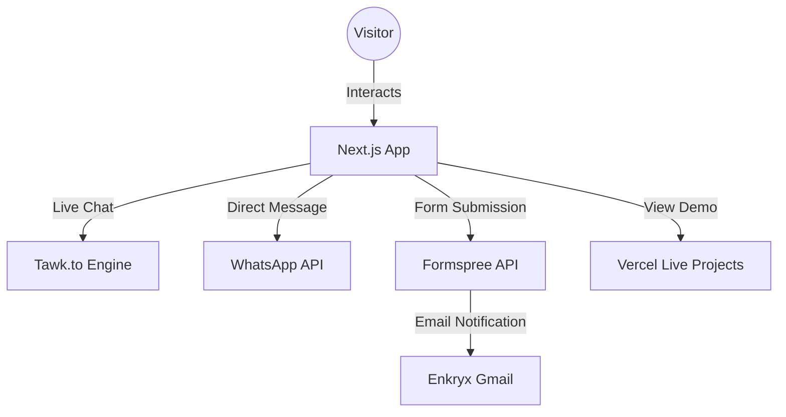

# ENKRYX - Modern Digital Solutions Agency

A high-performance, secure, and visually stunning agency website built with **Next.js 15**, **Tailwind CSS 4**, and **Lucide Icons**. Featuring a premium glassmorphic design and integrated communication tools.

### 🔗 Live Links
- **Official Website (Vercel):** [https://enkryx.vercel.app/](https://enkryx.vercel.app/)
- **WhatsApp Support:** [Chat on WhatsApp](https://wa.me/8801400019228)

---

## 📖 Table of Contents
1. [Project Overview](#project-overview)
2. [Key Features](#key-features)
3. [System Architecture](#system-architecture)
4. [Tech Stack](#tech-stack)
5. [Integrations](#integrations)
6. [Interactive Components](#interactive-components)
7. [Getting Started](#getting-started)
8. [Project Structure](#project-structure)
9. [Future Roadmap](#future-roadmap)

---

## 🌟 Project Overview
ENKRYX is a digital solutions agency focused on building simple, reliable, and scalable software. This website serves as the primary portal for client discovery, portfolio showcase, and direct communication. It utilizes modern "iPhone 16" inspired glassmorphism to project a premium, state-of-the-art brand image.

---

## 🚀 Key Features
- **Premium Glassmorphism:** Custom-built UI using translucent layers, backdrop blurs, and high-end typography.
- **Dynamic Entrance Animations:** Smooth scroll-reveal and staggered entrance effects for every section.
- **Floating Communication Hub:** Integrated **Tawk.to** live chat and **WhatsApp** direct messaging.
- **Automated Lead Gen:** Contact form connected to **Formspree** for instant email notifications.
- **Dynamic Portfolio:** Project cards that link directly to live functional demos.
- **Fully Responsive:** Optimized for everything from mobile phones up to Ultra-Wide monitors.

---

## 🧠 System Architecture


---

## 🛠️ Tech Stack
### Frontend & Core
- **Framework:** Next.js (App Router)
- **Library:** React 19
- **Styling:** Tailwind CSS 4 (Custom Utilities)
- **Icons:** Lucide React
- **Animations:** CSS Keyframes & Tailwind Transitions

---

## 🔄 Core Workflows

### 1. Lead Capture Workflow
- Visitor fills out the **Contact Form**.
- Data is sent via `fetch` to the Formspree endpoint.
- Team receives a real-time email notification.
- Success/Error states are managed dynamically within the component.

### 2. Interactive Discovery
- Visitor browses the **Services** section with staggered entrance animations.
- Visitor explores the **Portfolio**; clicking a project opens the live demo in a new tab.
- Floating **WhatsApp** or **Tawk.to** allows for instant sales consultation.

---

## 🛠️ Getting Started

### Prerequisites
- Node.js (v18.17+)
- npm or yarn

### Setup
1. Clone the repository:
   ```bash
   git clone https://github.com/noman1922/enkryx.git
   ```
2. Install dependencies:
   ```bash
   npm install
   ```
3. Run the development server:
   ```bash
   npm run dev
   ```
   *The site will be available at:* `http://localhost:3000`

---

## 📁 Project Structure
```text
Enkryx-Website/
├── public/                    # Images, Icons, and Favicons
├── src/
│   ├── app/                   # App Router (Pages & Layout)
│   ├── components/            # Reusable UI Blocks (Hero, Team, etc.)
│   ├── data/                  # siteData.json (Central Content Storage)
│   └── styles/                # Global CSS & Tailwind Config
├── README.md
└── package.json
```

---

## 🔮 Future Roadmap
- **Case Studies**: Deep-dive pages for each major project.
- **Blog Section**: Sharing insights on software architecture and design.
- **Client Portal**: Secure area for project timeline tracking.

---

## 👨‍💻 Authors

**Md. Abdullah Al Noman Khan**  
*Co-Founder, Product & Engineering*  
Computer Science & Engineering  
IUBAT – International University of Business Agriculture and Technology


